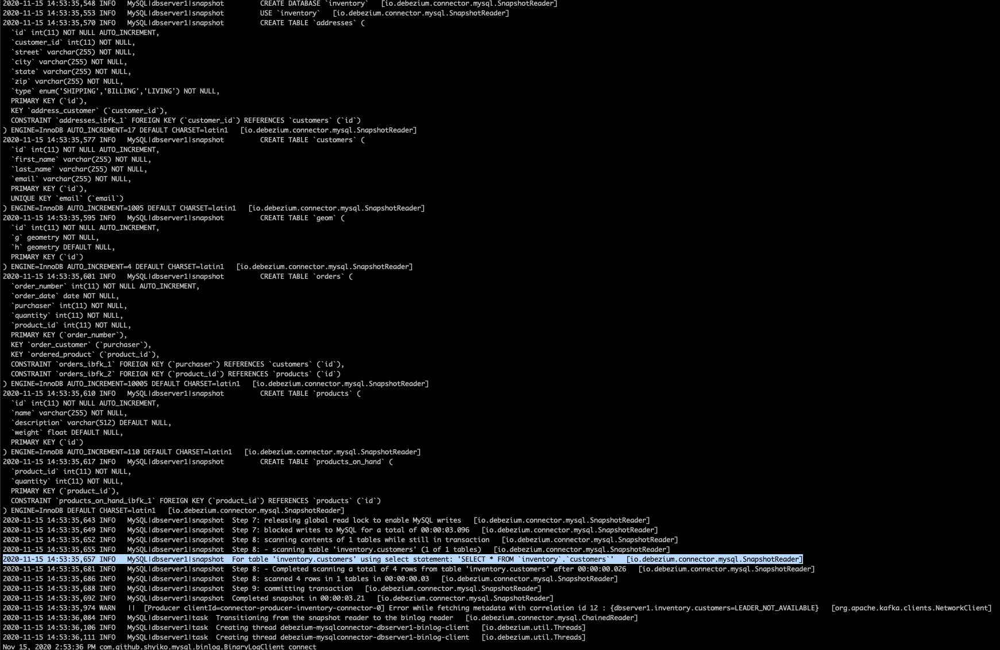

# debezium-research

## MySQL snapshotting behaviour

Please note, this uses the Debezium's MySQL tutorial as a starting point

### What we want to achieve

Have an initial setup such as
```
curl -i -X POST -H "Accept:application/json" -H "Content-Type:application/json" localhost:8083/connectors/ -d '{ "name": "inventory-connector", "config": { "connector.class": "io.debezium.connector.mysql.MySqlConnector", "tasks.max": "1", "database.hostname": "mysql", "database.port": "3306", "database.user": "debezium", "database.password": "dbz", "database.server.id": "184054", "database.server.name": "dbserver1", "database.include.list": "inventory", "table.include.list": "inventory.customers", "database.history.kafka.bootstrap.servers": "kafka:9092", "database.history.kafka.topic": "dbhistory.inventory", "snapshot.mode": "when_needed" } }'
```

This has an `table.include.list` of `inventory.customers` and when the snapshotting behaviour happens, it only does a snapshot for the `inventory.customers` table. See 

Now we've delete the existing connector
```
curl -i -X DELETE -H "Accept:application/json" localhost:8083/connectors/inventory-connector
```

and re-add the connector with `table.include.list` of `inventory.customers, inventory.orders`

```
curl -i -X POST -H "Accept:application/json" -H "Content-Type:application/json" localhost:8083/connectors/ -d '{ "name": "inventory-connector", "config": { "connector.class": "io.debezium.connector.mysql.MySqlConnector", "tasks.max": "1", "database.hostname": "mysql", "database.port": "3306", "database.user": "debezium", "database.password": "dbz", "database.server.id": "184054", "database.server.name": "dbserver1", "database.include.list": "inventory", "table.include.list": "inventory.customers, inventory.orders", "database.history.kafka.bootstrap.servers": "kafka:9092", "database.history.kafka.topic": "dbhistory.inventory", "snapshot.mode": "when_needed" } }'
```

The expected snapshot behaviour for `when_needed` is because the offset for `inventory.orders` does not exist yet, it should get a refresh snapshot of `inventory.orders` from the source database and start tracking offsets from now. 
 

### What actually happens

The connector threw an error on offset does not exist and then created a new topic called `inventory.orders` in Kafka, all changes made in MySQL from this point onwards on `inventory.orders` are now tracked. 

The MySQL connector has a default [snapshot](https://debezium.io/documentation/reference/1.3/connectors/mysql.html#mysql-property-snapshot-mode) of `initial` we've changed it to `when_needed` and hoping it would trigger the expected behaviour. But not snapshot were made. 

In conclusion, there does not appear to be a way to add new tables to the inclusion list and automatically trigger a snapshot behaviour on newly added tables. What is possible though is that if all topics in Kafka are deleted (basically resets the whole thing) then it does a snapshot of all tables again.  

[This post](https://stackoverflow.com/questions/61091091/how-to-do-an-initial-snapshot-load-with-debezium-mysql-connector-kafka) also explains the same behaviour.

### Why this happens

I am very new to Debezium, so this is purely an assumption. As shown in the screenshot, we can see even though only the `inventory.customers` table is in the inclusion list, it still did a snapshot of `schemas only` from all other inside the inventory database. This might be what is preventing the connector from making snapshots again. 

### Next
As described in the snapshot documentation, `when_needed` has the following behaviour,
```
The when_needed option specifies that the connector run a snapshot upon startup whenever it deems it necessary (when no offsets are available, or when a previously recorded offset specifies a binlog location or GTID that is not available in the server)
```

And in theory, the following scenario is worth trying
1. After adding `inventory.orders` to the inclusion list, immediately restart the Kafka Connect server to see if it does a snapshot when starting up for inventory.orders. 
1. If the above does not work, stop the Kafka Connect service, try removing the offset of `inventory.orders` from Kafka and start the Kafka Connect service again. 

